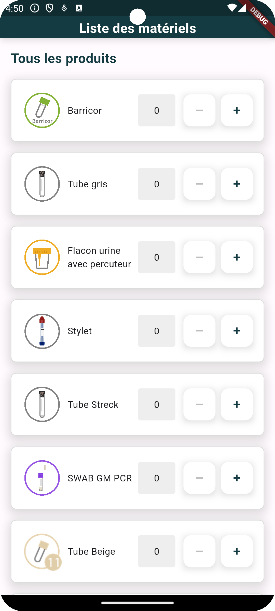

# Test technique flutter

Ce repo contient un setup minimal d'une application Flutter.

## Premier exercice : intégration design

Dans cet exercice vous devrez afficher sur la Home Page une liste de matériel.

La réalisation design est libre mais devra être propre.
Un screenshot contenant le rendu attendu est disponible ci-dessous pour vous aider dans la réalisation de la page.

Plusieurs widgets et outils sont directement dans le setup du projet pour vous aider.

N'hésitez pas à explorer le code déjà présent dans l'application.

## Deuxième exercice : intégration de la gestion d'un panier

Le but de cet exercice est de réaliser la gestion d'un panier de commande basé sur la liste des matériels que vous aurez réaliser ci dessus.

L'exercice est libre et la gestion du panier devra uniquement être stocké en mémoire dans un objet.
